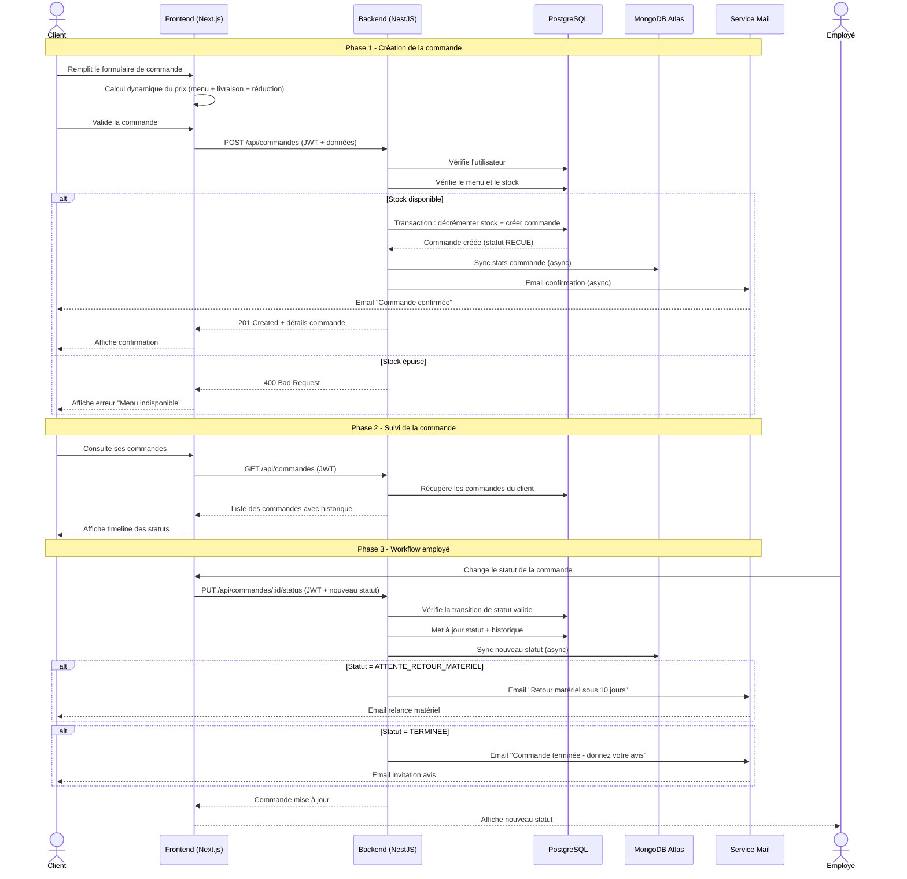

# Documentation Technique - Vite & Gourmand

## 1. Presentation du projet

### 1.1 Contexte
**Vite & Gourmand** est le projet que j'ai développé dans le cadre de mon ECF pour le titre professionnel Développeur Web et Web Mobile. Il s'agit d'une application web complète pour un traiteur événementiel basé à Bordeaux. L'idée est simple : permettre aux clients de consulter les menus, passer des commandes pour leurs événements (mariages, anniversaires, séminaires...) et suivre l'avancement de leurs prestations. Côté équipe, un back-office permet de gérer les commandes au quotidien, modérer les avis et administrer les contenus du site.

### 1.2 Objectifs
Les objectifs que je me suis fixés pour ce projet :
- Proposer aux visiteurs une vitrine claire et attractive de l'offre traiteur
- Offrir un parcours de commande simple, de la consultation du menu jusqu'à la confirmation
- Mettre à disposition un back-office pratique pour l'équipe au quotidien
- Assurer la sécurité des données et le respect du RGPD

### 1.3 Public cible
L'application s'adresse à quatre profils d'utilisateurs :
- **Visiteurs** : particuliers ou professionnels qui découvrent le site et cherchent un traiteur
- **Clients inscrits** : utilisateurs qui veulent passer et suivre leurs commandes
- **Employés** : l'équipe opérationnelle qui gère les commandes et le contenu
- **Administrateur** : le gérant, avec un accès complet à toutes les fonctionnalités

---

## 2. Architecture technique

### 2.1 Vue d'ensemble

J'ai structuré l'application selon une architecture **client-serveur** classique, avec une séparation nette entre le frontend et le backend. Le frontend (Next.js) s'occupe de l'affichage et de l'expérience utilisateur, tandis que le backend (NestJS) gère la logique métier et les données via une API REST :

```
┌─────────────────────┐     HTTP/REST     ┌─────────────────────┐
│                     │  ──────────────>  │                     │
│   Frontend          │                   │   Backend API       │
│   Next.js 16        │  <──────────────  │   NestJS 11         │
│   Port 3001         │     JSON          │   Port 3000         │
│                     │                   │                     │
└─────────────────────┘                   └──────────┬──────────┘
                                                     │
                                          ┌──────────┴──────────┐
                                          │                     │
                                    Prisma ORM           Mongoose
                                          │                     │
                               ┌──────────▼──────┐  ┌──────────▼──────┐
                               │  PostgreSQL     │  │  MongoDB Atlas  │
                               │  (Neon)         │  │  (NoSQL stats)  │
                               └─────────────────┘  └─────────────────┘
```

> **Double base de données** : PostgreSQL gère les données relationnelles (utilisateurs, menus, commandes) tandis que MongoDB stocke les statistiques agrégées pour le dashboard admin (commandes par menu, chiffre d'affaires).

### 2.2 Frontend - Next.js 16

Pour le frontend, j'ai travaillé avec l'aide de **Claude Code** (Anthropic), un assistant IA intégré directement dans **Visual Studio Code**. Cet outil m'a permis d'accélérer le développement tout en gardant la main sur les choix d'architecture et de design. J'ai fait le choix de travailler en **JSX/TSX** (la syntaxe de React) pour avoir un rendu plus qualitatif et un contrôle fin sur chaque composant de l'interface.

**Choix technologiques :**
- **Next.js 16 (App Router)** : j'ai choisi ce framework React pour son rendu serveur natif, son routing basé sur le système de fichiers et ses optimisations SEO intégrées
- **React 19.2** : la dernière version stable, avec les hooks pour une gestion propre de l'état
- **TypeScript 5** : le typage statique me permet de détecter les erreurs avant l'exécution et rend le code plus fiable
- **Tailwind CSS v4** : framework CSS utility-first que j'apprécie pour sa rapidité de développement, configuré via `@theme inline` (approche CSS-first)
- **Framer Motion 12** : pour des animations fluides et performantes (accélérées par le GPU)
- **Lucide React** : icônes SVG légères et tree-shakeable (seules celles utilisées sont incluses dans le bundle final)

**Architecture des pages (22 routes) :**

| Route | Page | Accès |
|-------|------|-------|
| `/` | Page d'accueil | Public |
| `/menus` | Catalogue des menus | Public |
| `/menus/:id` | Détail d'un menu | Public |
| `/contact` | Formulaire de contact | Public |
| `/mentions-legales` | Mentions légales | Public |
| `/cgv` | Conditions générales de vente | Public |
| `/connexion` | Page de connexion | Public |
| `/inscription` | Page d'inscription | Public |
| `/mot-de-passe-oublie` | Mot de passe oublié | Public |
| `/reset-password` | Réinitialisation mot de passe | Public |
| `/mon-compte` | Tableau de bord client | Authentifié |
| `/mon-compte/commandes` | Liste des commandes | Authentifié |
| `/mon-compte/commandes/:id` | Détail d'une commande | Authentifié |
| `/commander/:menuId` | Passer une commande | Authentifié |
| `/admin` | Dashboard administrateur | Employé/Admin |
| `/admin/commandes` | Gestion des commandes | Employé/Admin |
| `/admin/menus` | Gestion des menus | Employé/Admin |
| `/admin/avis` | Modération des avis | Employé/Admin |
| `/admin/horaires` | Gestion des horaires | Admin |
| `/admin/employes` | Gestion des employés | Admin |

**Composants réutilisables :**
J'ai créé une bibliothèque de composants réutilisables pour garder une cohérence visuelle sur tout le site :
- `Button` : bouton avec 5 variantes (primary, secondary, outline, ghost, danger) et un état loading
- `Input` / `Textarea` : champs de formulaire avec gestion du label et des erreurs
- `Card` : carte avec animation de survol grâce à Framer Motion
- `Badge` : étiquette colorée pour les tags et statuts

**Gestion de l'authentification :**
J'ai mis en place l'authentification côté client via un React Context (`AuthProvider`). Concrètement, le token JWT est stocké dans le `localStorage` du navigateur et ajouté automatiquement aux en-têtes de chaque requête API grâce au client HTTP centralisé (`lib/api.ts`). C'est simple et ça fonctionne bien pour ce type de projet.

### 2.3 Backend - NestJS 11

Pour le backend, j'ai opté pour NestJS qui offre une structure modulaire très claire. Chaque fonctionnalité est isolée dans son propre module, ce qui facilite la maintenance et les tests.

**Choix technologiques :**
- **NestJS 11** : framework Node.js modulaire avec injection de dépendances native
- **Prisma 7** : ORM type-safe qui génère automatiquement les types TypeScript depuis le schéma
- **PostgreSQL** : base de données relationnelle robuste, hébergée sur Neon
- **Passport + JWT** : authentification stateless par tokens, simple et efficace
- **class-validator** : validation déclarative des DTOs (on décore les propriétés et NestJS valide automatiquement)
- **Nodemailer** : envoi d'emails pour le contact et la réinitialisation de mot de passe

**Modules de l'API (8 modules métier) :**

| Module | Responsabilité |
|--------|---------------|
| `AuthModule` | Inscription, connexion, JWT, reset password |
| `MenuModule` | CRUD menus, filtrage par thème/régime/prix |
| `PlatModule` | CRUD plats, gestion des allergènes |
| `CommandeModule` | Création commande, workflow statut, annulation |
| `AvisModule` | Création et modération des avis |
| `HoraireModule` | Gestion des horaires d'ouverture |
| `ContactModule` | Envoi d'emails via le formulaire |
| `AdminModule` | Statistiques, création d'employés |

**Modules techniques :**

| Module | Responsabilité |
|--------|---------------|
| `PrismaModule` | Connexion à la base de données |
| `MailModule` | Service d'envoi d'emails |

### 2.4 Base de données - PostgreSQL

J'ai défini tout le schéma de données dans Prisma, ce qui me permet de générer automatiquement les migrations SQL et les types TypeScript. Le schéma comporte :
- **12 modèles** (tables)
- **3 enums** (PlatType, CommandeStatut, AvisStatut)
- **4 tables de liaison** (MenuTheme, MenuRegime, MenuPlat, PlatAllergene)

**Diagramme des relations principales :**

```
Role (1) ──── (N) Utilisateur
                     │
                     ├── (N) Commande ──── (1) Menu
                     │         │
                     │         ├── (N) CommandeHistorique
                     │         └── (0..1) Avis
                     │
                     └── (N) Avis

Menu (N) ──── (N) Theme     (via MenuTheme)
Menu (N) ──── (N) Regime    (via MenuRegime)
Menu (N) ──── (N) Plat      (via MenuPlat)
Menu (1) ──── (N) MenuImage

Plat (N) ──── (N) Allergene (via PlatAllergene)
```

---

## 3. Securite

La sécurité a été un point important tout au long du développement. Voici les mesures que j'ai mises en place.

### 3.1 Authentification

- **JWT (JSON Web Token)** : j'utilise des tokens signés avec un secret configurable. L'expiration est paramétrable (24h par défaut)
- **Bcrypt** : les mots de passe sont hachés avec un salt de 10 rounds — même en cas de fuite de base, les mots de passe restent protégés
- **Stratégie Passport** : le token est extrait automatiquement depuis l'en-tête `Authorization: Bearer <token>`

### 3.2 Autorisation (RBAC)

J'ai mis en place trois rôles hiérarchiques pour contrôler l'accès aux différentes parties de l'application :
1. **Utilisateur** : accès uniquement à son espace client personnel
2. **Employé** : accès au back-office pour gérer les commandes et les avis
3. **Administrateur** : accès complet, y compris la gestion des horaires, des employés et les statistiques

L'implémentation repose sur un décorateur personnalisé `@Roles()` et un guard `RolesGuard` dans NestJS.

### 3.3 Validation des données

- Tous les DTOs sont validés automatiquement grâce à `class-validator` (format email, longueurs, etc.)
- J'ai imposé une politique de mot de passe solide : minimum 10 caractères, avec au moins 1 majuscule, 1 minuscule, 1 chiffre et 1 caractère spécial
- Pour éviter l'énumération de comptes, la route `forgot-password` retourne toujours un message de succès, que l'email existe ou non

### 3.4 CORS

La configuration CORS n'autorise que l'origine du frontend (`http://localhost:3001` en développement, l'URL Vercel en production).

### 3.5 Conformité RGPD

- Une page de mentions légales détaille la collecte et l'utilisation des données
- Les droits d'accès et de suppression des données sont mentionnés
- Les mots de passe sont hashés et les données personnelles stockées de manière sécurisée

---

## 4. Fonctionnalites detaillées

### 4.1 Catalogue de menus

Les visiteurs peuvent consulter librement tous les menus et les filtrer par :
- **Thème** : Noël, Pâques, Classique, Événement
- **Régime alimentaire** : Classique, Végétarien, Végan, Sans gluten
- **Budget maximum** : par prix/personne
- **Recherche** : par mot-clé dans le titre

Chaque menu affiche sa composition complète (entrées, plats, desserts) avec les allergènes de chaque plat.

### 4.2 Processus de commande

Le parcours de commande se déroule en quelques étapes :
1. Le client choisit un menu dans le catalogue
2. Il remplit le formulaire avec la date, l'heure, l'adresse de livraison et le nombre de personnes
3. Le prix est calculé en temps réel à l'écran :
   - Prix du menu = prix/personne x nombre de personnes
   - Livraison = gratuit à Bordeaux, sinon 5€ + 0,59€/km
   - Une réduction de 10% s'applique automatiquement si le nombre de personnes dépasse le minimum du menu de 5 ou plus
4. À la validation, une confirmation est envoyée par email

### 4.3 Workflow des commandes

Chaque commande passe par un cycle de vie bien défini :

```
RECUE ─> ACCEPTEE ─> EN_PREPARATION ─> EN_LIVRAISON ─> LIVREE ─> ATTENTE_RETOUR_MATERIEL ─> TERMINEE
```

- Le client peut **annuler** sa commande tant qu'elle n'a pas encore été acceptée par l'équipe (statut RECUE)
- L'employé fait avancer le statut étape par étape depuis le back-office
- Chaque changement de statut est horodaté et enregistré dans un historique (`CommandeHistorique`), ce qui permet au client de suivre l'avancement

### 4.4 Système d'avis

- Après une commande terminée, le client peut laisser un avis avec une note de 1 à 5 et un commentaire
- Tous les avis passent par une modération : l'équipe peut les valider ou les refuser
- Seuls les avis validés apparaissent sur le site public, ce qui garantit la qualité du contenu

### 4.5 Back-office

J'ai développé un back-office complet accessible via `/admin`. Il permet à l'équipe de :
- Visualiser un **dashboard** avec les statistiques par menu (nombre de commandes, chiffre d'affaires)
- Gérer les **commandes** et faire avancer leur statut dans le workflow
- **Modérer les avis** en un clic (valider ou refuser)
- Mettre à jour les **horaires** d'ouverture
- **Créer des comptes employés** (réservé à l'administrateur)

---

## 5. Choix techniques justifies

Voici les principaux choix techniques que j'ai faits et pourquoi.

### 5.1 Next.js 16 vs autres frameworks

| Critère | Next.js | Create React App | Vue.js |
|---------|---------|------------------|--------|
| SEO natif | Oui (SSR/SSG) | Non | Nuxt requis |
| Performance | Optimale (code splitting auto) | Manuelle | Bonne |
| Routing | File-system | React Router | Vue Router |
| Écosystème | Très riche | Riche | Bon |

**Mon choix : Next.js** — le SEO natif était un vrai plus pour un site vitrine de traiteur, et le routing file-system simplifie beaucoup l'organisation du code.

### 5.2 NestJS vs Express

| Critère | NestJS | Express |
|---------|--------|---------|
| Structure | Modulaire (modules, services, controllers) | Libre |
| TypeScript | Natif | Ajout manuel |
| Injection de dépendances | Oui | Non |
| Validation | Intégrée (pipes) | Middleware |

**Mon choix : NestJS** — sa structure modulaire me permet de garder un code propre et organisé, et le TypeScript natif évite les erreurs classiques.

### 5.3 Prisma vs TypeORM

| Critère | Prisma | TypeORM |
|---------|--------|---------|
| Type safety | Génération automatique | Partiel |
| Migrations | Automatiques | Semi-automatiques |
| Syntaxe | Déclarative (schéma) | Decorators |
| Performance | Très bonne | Bonne |

**Mon choix : Prisma** — le fait de définir le schéma dans un seul fichier et d'obtenir automatiquement les types TypeScript et les migrations est un gain de temps énorme.

### 5.4 Tailwind CSS v4 vs CSS classique / SCSS

| Critère | Tailwind CSS | CSS/SCSS | Styled Components |
|---------|-------------|----------|-------------------|
| Productivité | Très haute | Moyenne | Haute |
| Bundle size | Minimal (purge) | Variable | Runtime overhead |
| Responsive | Utilitaires natifs | Media queries | Media queries |
| Maintenance | Excellente | Difficile à scale | Bonne |

**Mon choix : Tailwind CSS v4** — j'apprécie pouvoir styliser directement dans le JSX sans jongler entre fichiers CSS. Le bundle final est minimal grâce au purge automatique.

---

## 6. SEO et performance

J'ai porté une attention particulière au référencement et aux performances, car un site de traiteur doit être bien positionné sur Google et charger rapidement.

### 6.1 Optimisations SEO

- **Métadonnées** : title templates, descriptions OpenGraph sur toutes les pages
- **Données structurées** : schéma JSON-LD `Restaurant` sur la page d'accueil
- **Sitemap XML** : généré dynamiquement (`/sitemap.xml`)
- **Robots.txt** : pages admin et compte exclues de l'indexation
- **URLs propres** : routes françaises lisibles (`/menus`, `/contact`, `/mentions-legales`)

### 6.2 Optimisations de performance

- **Polices** : chargement optimisé via `next/font/google` (auto-hébergées, pas de requête externe)
- **Images** : composant `next/image` avec lazy loading et optimisation automatique
- **Animations** : Framer Motion utilise les propriétés CSS `transform` et `opacity` (GPU-accelerated)
- **Code splitting** : automatique par route avec Next.js App Router
- **Tree shaking** : Lucide React n'inclut que les icônes importées

---

## 7. Déploiement

### 7.1 Environnements

| Environnement | Frontend | Backend | BDD |
|---------------|----------|---------|-----|
| Développement | localhost:3001 | localhost:3000 | PostgreSQL local ou Neon |
| Production | Vercel | Vercel (serverless) | Neon |

### 7.2 Variables d'environnement

**Backend (`apps/api/.env`) :**
```
DATABASE_URL=            # URL de connexion PostgreSQL (Neon)
MONGODB_URI=             # URL de connexion MongoDB Atlas (pour stats NoSQL)
JWT_SECRET=              # Secret de signature JWT (min. 32 caractères)
JWT_EXPIRES_IN=          # Durée de validité du token (ex: 7d)
FRONTEND_URL=            # URL du frontend (pour CORS et liens email)
SMTP_HOST=               # Serveur SMTP
SMTP_PORT=               # Port SMTP
SMTP_USER=               # Email expéditeur
SMTP_PASS=               # Mot de passe email
MAIL_FROM=               # Adresse expéditeur (ex: noreply@viteetgourmand.fr)
```

**Frontend (`apps/web/.env.local`) :**
```
NEXT_PUBLIC_API_URL=     # URL de l'API backend
```

---

## 8. Données de démonstration

Pour tester et présenter l'application, j'ai créé un fichier `seed.ts` qui remplit la base avec des données réalistes :

- **3 rôles** : administrateur, employé, utilisateur
- **3 utilisateurs** : un admin, un employé, un client
- **4 thèmes** : Noël, Pâques, Classique, Événement
- **4 régimes** : Classique, Végétarien, Végan, Sans gluten
- **14 allergènes** : liste réglementaire européenne complète
- **18 plats** : 6 entrées, 6 plats, 6 desserts avec allergènes associés
- **5 menus** : compositions variées avec thèmes et régimes
- **7 horaires** : lundi à dimanche
- **2 commandes** : une terminée, une en cours
- **1 avis** : validé avec note 5/5

---

## 9. Modele Conceptuel de Donnees (MCD)

Le MCD ci-dessous représente l'ensemble des entités de l'application et leurs associations. Je me suis basé sur l'Annexe 1 du cahier des charges (MCD fourni) et je l'ai étendu pour couvrir tous les besoins fonctionnels identifiés (images de menus, historique de commandes, etc.).

```mermaid
erDiagram
    ROLE ||--o{ UTILISATEUR : "possède"
    UTILISATEUR ||--o{ COMMANDE : "passe"
    UTILISATEUR ||--o{ AVIS : "rédige"

    MENU ||--o{ COMMANDE : "concerne"
    MENU ||--o{ MENU_IMAGE : "illustré par"
    MENU }o--o{ THEME : "associé à"
    MENU }o--o{ REGIME : "compatible avec"
    MENU }o--o{ PLAT : "composé de"

    PLAT }o--o{ ALLERGENE : "contient"

    COMMANDE ||--o{ COMMANDE_HISTORIQUE : "historise"
    COMMANDE ||--o| AVIS : "évalué par"

    ROLE {
        int role_id PK
        varchar libelle UK
    }

    UTILISATEUR {
        int utilisateur_id PK
        varchar email UK
        varchar password
        varchar nom
        varchar prenom
        varchar telephone
        varchar adresse_postale
        boolean is_active
        timestamp created_at
        int role_id FK
    }

    MENU {
        int menu_id PK
        varchar titre
        int nombre_personne_minimale
        float prix_par_personne
        text description
        int quantite_restante
        text conditions
    }

    MENU_IMAGE {
        int id PK
        varchar url
        varchar alt
        int menu_id FK
    }

    THEME {
        int theme_id PK
        varchar libelle UK
    }

    REGIME {
        int regime_id PK
        varchar libelle UK
    }

    PLAT {
        int plat_id PK
        varchar titre_plat
        varchar photo
        enum type
    }

    ALLERGENE {
        int allergene_id PK
        varchar libelle UK
    }

    COMMANDE {
        int id PK
        varchar numero_commande UK
        timestamp date_commande
        timestamp date_prestation
        varchar heure_prestation
        varchar adresse
        float prix_menu
        int nombre_personnes
        float prix_livraison
        enum statut
        boolean validation_materiel
        text motif_annulation
        varchar mode_contact
        int utilisateur_id FK
        int menu_id FK
    }

    COMMANDE_HISTORIQUE {
        int id PK
        enum statut
        timestamp date
        int commande_id FK
    }

    AVIS {
        int avis_id PK
        int note
        text description
        enum statut
        timestamp created_at
        int utilisateur_id FK
        int commande_id FK
    }

    HORAIRE {
        int horaire_id PK
        varchar jour UK
        varchar heure_ouverture
        varchar heure_fermeture
    }
```



### Tables de liaison (Many-to-Many)

| Table | Clés composites | Description |
|-------|----------------|-------------|
| `menu_theme` | (menu_id, theme_id) | Association menu ↔ thème |
| `menu_regime` | (menu_id, regime_id) | Association menu ↔ régime alimentaire |
| `menu_plat` | (menu_id, plat_id) | Composition d'un menu en plats |
| `plat_allergene` | (plat_id, allergene_id) | Allergènes présents dans un plat |

---

## 10. Diagramme de cas d'utilisation

Le diagramme ci-dessous montre les interactions des différents acteurs avec le système.

```mermaid
graph TB
    subgraph Acteurs
        V((Visiteur))
        C((Client))
        E((Employé))
        A((Administrateur))
    end

    subgraph "Espace Public"
        UC1[Consulter les menus]
        UC2[Filtrer les menus par thème/régime/prix]
        UC3[Voir le détail d'un menu]
        UC4[Envoyer un message via le formulaire contact]
        UC5[Consulter les mentions légales / CGV]
        UC6[Voir les avis clients validés]
    end

    subgraph "Authentification"
        UC7[S'inscrire]
        UC8[Se connecter]
        UC9[Réinitialiser son mot de passe]
    end

    subgraph "Espace Client"
        UC10[Passer une commande]
        UC11[Suivre ses commandes]
        UC12[Modifier/Annuler une commande]
        UC13[Laisser un avis sur une commande terminée]
        UC14[Consulter son profil]
    end

    subgraph "Espace Employé"
        UC15[Gérer les commandes - avancer le statut]
        UC16[Annuler une commande avec motif]
        UC17[Modérer les avis]
        UC18[Gérer les menus et plats CRUD]
        UC19[Gérer les horaires]
    end

    subgraph "Espace Administrateur"
        UC20[Créer un compte employé]
        UC21[Désactiver un compte employé]
        UC22[Consulter les statistiques - graphiques]
        UC23[Consulter le CA par menu]
    end

    V --> UC1
    V --> UC2
    V --> UC3
    V --> UC4
    V --> UC5
    V --> UC6
    V --> UC7
    V --> UC8
    V --> UC9

    C --> UC1
    C --> UC2
    C --> UC3
    C --> UC10
    C --> UC11
    C --> UC12
    C --> UC13
    C --> UC14

    E --> UC15
    E --> UC16
    E --> UC17
    E --> UC18
    E --> UC19

    A --> UC15
    A --> UC16
    A --> UC17
    A --> UC18
    A --> UC19
    A --> UC20
    A --> UC21
    A --> UC22
    A --> UC23
```



> **Note** : L'administrateur hérite de tous les droits de l'employé. Le client hérite des droits du visiteur.

---

## 11. Diagramme de sequence - Parcours commande

Ce diagramme illustre le flux complet d'une commande, de la création à la terminaison.



---

## 12. Diagramme de classe (Backend NestJS)

Ce diagramme montre l'architecture des modules, services et contrôleurs du backend.

```mermaid
classDiagram
    class AppModule {
        +imports: Module[]
    }

    class AuthModule {
        +controllers: AuthController
        +providers: AuthService, JwtStrategy
    }

    class AuthController {
        +register(dto: RegisterDto)
        +login(dto: LoginDto)
        +forgotPassword(dto: ForgotPasswordDto)
        +resetPassword(dto: ResetPasswordDto)
        +getProfile(user: CurrentUser)
    }

    class AuthService {
        -prisma: PrismaService
        -jwtService: JwtService
        -mailService: MailService
        +register(dto: RegisterDto)
        +login(dto: LoginDto)
        +forgotPassword(email: string)
        +resetPassword(token: string, password: string)
    }

    class MenuModule {
        +controllers: MenuController
        +providers: MenuService
    }

    class MenuService {
        -prisma: PrismaService
        +findAll(filters: MenuFilterDto)
        +findOne(id: number)
        +create(dto: CreateMenuDto)
        +update(id: number, dto: UpdateMenuDto)
        +remove(id: number)
    }

    class CommandeModule {
        +controllers: CommandeController
        +providers: CommandeService
    }

    class CommandeService {
        -prisma: PrismaService
        -mailService: MailService
        -mongoService: MongoService
        +create(dto: CreateCommandeDto, userId: number)
        +findAll(userId: number, role: string)
        +findOne(id: number, userId: number, role: string)
        +update(id: number, dto: UpdateCommandeDto, userId: number)
        +cancel(id: number, userId: number)
        +updateStatut(id: number, dto: UpdateStatutDto)
    }

    class AdminModule {
        +controllers: AdminController
        +providers: AdminService
    }

    class AdminService {
        -prisma: PrismaService
        -mailService: MailService
        -mongoService: MongoService
        +getOrderStats()
        +getRevenueStats(filters)
        +createEmployee(dto: CreateEmployeeDto)
        +disableEmployee(id: number)
        +syncOrderStats()
    }

    class MongoModule {
        +providers: MongoService
        +exports: MongoService
    }

    class MongoService {
        -orderStatModel: Model~OrderStat~
        +upsertOrderStat(data)
        +getOrderStatsByMenu()
        +getRevenueStats(filters)
        +bulkUpsert(data[])
    }

    class PrismaModule {
        +providers: PrismaService
        +exports: PrismaService
    }

    class PrismaService {
        +onModuleInit()
        +onModuleDestroy()
    }

    class MailModule {
        +providers: MailService
        +exports: MailService
    }

    class MailService {
        -transporter: Transporter
        +sendWelcomeEmail(to, name)
        +sendResetPasswordEmail(to, name, link)
        +sendOrderConfirmationEmail(to, name, orderNum, total)
        +sendMaterielReturnEmail(to, name, orderNum)
        +sendOrderCompletedEmail(to, name, orderNum)
        +sendEmployeeCreatedEmail(to, name, email)
        +sendContactEmail(title, description, email)
    }

    class JwtAuthGuard {
        +canActivate(context)
    }

    class RolesGuard {
        +canActivate(context)
    }

    AppModule --> AuthModule
    AppModule --> MenuModule
    AppModule --> CommandeModule
    AppModule --> AdminModule
    AppModule --> MongoModule
    AppModule --> PrismaModule
    AppModule --> MailModule

    AuthModule --> PrismaModule
    AuthModule --> MailModule
    MenuModule --> PrismaModule
    CommandeModule --> PrismaModule
    CommandeModule --> MailModule
    CommandeModule --> MongoModule
    AdminModule --> PrismaModule
    AdminModule --> MailModule
    AdminModule --> MongoModule

    AuthModule ..> JwtAuthGuard
    AuthModule ..> RolesGuard
```



---

## 13. Base de donnees NoSQL - MongoDB Atlas

### 13.1 Justification

L'ECF demande d'utiliser une base de données NoSQL en complément du SQL. J'ai choisi MongoDB Atlas pour stocker les **statistiques agrégées** du dashboard admin, car c'est un cas d'usage où le NoSQL a un vrai avantage par rapport au SQL :

| Critère | PostgreSQL (SQL) | MongoDB (NoSQL) |
|---------|-----------------|-----------------|
| Usage | Données relationnelles (CRUD) | Statistiques agrégées |
| Requêtes | JOIN complexes | Pipeline d'agrégation |
| Flexibilité | Schéma strict | Schéma flexible |
| Performance | Excellente pour CRUD | Excellente pour agrégations |

### 13.2 Collection `order_stats`

```javascript
{
  commandeId: 1,              // Référence PostgreSQL
  menuId: 1,
  menuTitre: "Menu Festif de Noël",
  dateCommande: ISODate("2026-02-15T10:00:00Z"),
  datePrestation: ISODate("2026-03-15T00:00:00Z"),
  nombrePersonnes: 8,
  prixMenu: 520.00,
  prixLivraison: 0.00,
  montantTotal: 520.00,
  statut: "TERMINEE",
  clientId: 3,
  clientNom: "Marie Dupont"
}
```

### 13.3 Pipelines d'agrégation

**Statistiques par menu :**
```javascript
db.order_stats.aggregate([
  { $group: {
      _id: { menuId: "$menuId", menuTitre: "$menuTitre" },
      totalCommandes: { $sum: 1 },
      chiffreAffaires: { $sum: "$montantTotal" }
  }},
  { $sort: { chiffreAffaires: -1 } }
])
```

### 13.4 Synchronisation

J'ai mis en place une synchronisation **non-bloquante** entre PostgreSQL et MongoDB. L'idée est que si MongoDB est momentanément indisponible, ça ne bloque pas le fonctionnement normal de l'application :
- À la création d'une commande → `upsertOrderStat()` est appelé en asynchrone (avec .catch silencieux)
- À chaque changement de statut → même mécanisme
- En cas de besoin, une synchronisation complète est disponible via `POST /api/admin/stats/sync`
