# Documentation Technique - Vite & Gourmand

## 1. Presentation du projet

### 1.1 Contexte
**Vite & Gourmand** est une application web pour un traiteur événementiel basé à Bordeaux. Elle permet aux clients de consulter les menus, passer des commandes pour des événements (mariages, anniversaires, séminaires...) et suivre leurs commandes. Un back-office permet à l'équipe de gérer les commandes, modérer les avis et administrer les contenus.

### 1.2 Objectifs
- Permettre aux visiteurs de découvrir l'offre traiteur et les menus disponibles
- Offrir un parcours de commande simple et complet pour les clients
- Fournir un back-office efficace pour la gestion quotidienne
- Garantir la sécurité des données et la conformité RGPD

### 1.3 Public cible
- **Visiteurs** : particuliers et professionnels recherchant un traiteur
- **Clients inscrits** : utilisateurs souhaitant commander et suivre leurs commandes
- **Employés** : équipe opérationnelle gérant les commandes au quotidien
- **Administrateur** : gérant de l'entreprise avec accès complet

---

## 2. Architecture technique

### 2.1 Vue d'ensemble

L'application suit une architecture **client-serveur** avec séparation complète frontend/backend :

```
┌─────────────────────┐     HTTP/REST     ┌─────────────────────┐
│                     │  ──────────────>  │                     │
│   Frontend          │                   │   Backend API       │
│   Next.js 16        │  <──────────────  │   NestJS 11         │
│   Port 3001         │     JSON          │   Port 3000         │
│                     │                   │                     │
└─────────────────────┘                   └──────────┬──────────┘
                                                     │
                                          ┌──────────┴──────────┐
                                          │                     │
                                    Prisma ORM           Mongoose
                                          │                     │
                               ┌──────────▼──────┐  ┌──────────▼──────┐
                               │  PostgreSQL     │  │  MongoDB Atlas  │
                               │  (Neon)         │  │  (NoSQL stats)  │
                               └─────────────────┘  └─────────────────┘
```

> **Double base de données** : PostgreSQL gère les données relationnelles (utilisateurs, menus, commandes) tandis que MongoDB stocke les statistiques agrégées pour le dashboard admin (commandes par menu, chiffre d'affaires).

### 2.2 Frontend - Next.js 16

**Choix technologiques :**
- **Next.js 16 (App Router)** : framework React avec rendu serveur, routing file-system et optimisations SEO natives
- **React 19.2** : dernière version stable avec les hooks
- **TypeScript 5** : typage statique pour la fiabilité du code
- **Tailwind CSS v4** : framework CSS utility-first, configuration via `@theme inline` (CSS-first)
- **Framer Motion 12** : bibliothèque d'animations performantes (GPU-accelerated)
- **Lucide React** : icônes SVG tree-shakeable (seules les icônes utilisées sont incluses dans le bundle)

**Architecture des pages (22 routes) :**

| Route | Page | Accès |
|-------|------|-------|
| `/` | Page d'accueil | Public |
| `/menus` | Catalogue des menus | Public |
| `/menus/:id` | Détail d'un menu | Public |
| `/contact` | Formulaire de contact | Public |
| `/mentions-legales` | Mentions légales | Public |
| `/cgv` | Conditions générales de vente | Public |
| `/connexion` | Page de connexion | Public |
| `/inscription` | Page d'inscription | Public |
| `/mot-de-passe-oublie` | Mot de passe oublié | Public |
| `/reset-password` | Réinitialisation mot de passe | Public |
| `/mon-compte` | Tableau de bord client | Authentifié |
| `/mon-compte/commandes` | Liste des commandes | Authentifié |
| `/mon-compte/commandes/:id` | Détail d'une commande | Authentifié |
| `/commander/:menuId` | Passer une commande | Authentifié |
| `/admin` | Dashboard administrateur | Employé/Admin |
| `/admin/commandes` | Gestion des commandes | Employé/Admin |
| `/admin/menus` | Gestion des menus | Employé/Admin |
| `/admin/avis` | Modération des avis | Employé/Admin |
| `/admin/horaires` | Gestion des horaires | Admin |
| `/admin/employes` | Gestion des employés | Admin |

**Composants réutilisables :**
- `Button` : bouton avec variantes (primary, secondary, outline, ghost, danger) et état loading
- `Input` : champ de formulaire avec label et erreur
- `Textarea` : zone de texte avec label et erreur
- `Card` : carte avec animation de survol (Framer Motion)
- `Badge` : badge/étiquette coloré

**Gestion de l'authentification :**
L'authentification est gérée côté client via un React Context (`AuthProvider`). Le token JWT est stocké dans `localStorage` et automatiquement ajouté aux en-têtes des requêtes API via le client HTTP centralisé (`lib/api.ts`).

### 2.3 Backend - NestJS 11

**Choix technologiques :**
- **NestJS 11** : framework Node.js modulaire avec injection de dépendances
- **Prisma 7** : ORM type-safe avec génération automatique des types
- **PostgreSQL** : base de données relationnelle robuste
- **Passport + JWT** : authentification stateless par tokens
- **class-validator** : validation déclarative des DTOs
- **Nodemailer** : envoi d'emails (contact, reset password)

**Modules de l'API (8 modules métier) :**

| Module | Responsabilité |
|--------|---------------|
| `AuthModule` | Inscription, connexion, JWT, reset password |
| `MenuModule` | CRUD menus, filtrage par thème/régime/prix |
| `PlatModule` | CRUD plats, gestion des allergènes |
| `CommandeModule` | Création commande, workflow statut, annulation |
| `AvisModule` | Création et modération des avis |
| `HoraireModule` | Gestion des horaires d'ouverture |
| `ContactModule` | Envoi d'emails via le formulaire |
| `AdminModule` | Statistiques, création d'employés |

**Modules techniques :**

| Module | Responsabilité |
|--------|---------------|
| `PrismaModule` | Connexion à la base de données |
| `MailModule` | Service d'envoi d'emails |

### 2.4 Base de données - PostgreSQL

Le schéma est défini dans Prisma et comporte :
- **12 modèles** (tables)
- **3 enums** (PlatType, CommandeStatut, AvisStatut)
- **4 tables de liaison** (MenuTheme, MenuRegime, MenuPlat, PlatAllergene)

**Diagramme des relations principales :**

```
Role (1) ──── (N) Utilisateur
                     │
                     ├── (N) Commande ──── (1) Menu
                     │         │
                     │         ├── (N) CommandeHistorique
                     │         └── (0..1) Avis
                     │
                     └── (N) Avis

Menu (N) ──── (N) Theme     (via MenuTheme)
Menu (N) ──── (N) Regime    (via MenuRegime)
Menu (N) ──── (N) Plat      (via MenuPlat)
Menu (1) ──── (N) MenuImage

Plat (N) ──── (N) Allergene (via PlatAllergene)
```

---

## 3. Securite

### 3.1 Authentification

- **JWT (JSON Web Token)** : tokens signés avec un secret configurable, expiration paramétrable (24h par défaut)
- **Bcrypt** : hachage des mots de passe avec salt (10 rounds)
- **Stratégie Passport** : extraction automatique du token depuis l'en-tête `Authorization: Bearer <token>`

### 3.2 Autorisation (RBAC)

Trois rôles hiérarchiques :
1. **Utilisateur** : accès à son espace client uniquement
2. **Employé** : accès au back-office (commandes, avis)
3. **Administrateur** : accès complet (horaires, employés, statistiques)

Implémentation via un décorateur `@Roles()` et un guard `RolesGuard` NestJS.

### 3.3 Validation des données

- Validation sur tous les DTOs avec `class-validator` (email valide, longueurs, formats...)
- Politique de mot de passe fort : minimum 10 caractères, 1 majuscule, 1 minuscule, 1 chiffre, 1 caractère spécial
- Protection anti-énumération : la route `forgot-password` retourne toujours un succès, même si l'email n'existe pas

### 3.4 CORS

La configuration CORS autorise uniquement l'origine du frontend (`http://localhost:3001` en développement).

### 3.5 Conformité RGPD

- Page de mentions légales avec informations sur la collecte de données
- Droit d'accès et de suppression mentionné
- Données personnelles stockées de manière sécurisée (mots de passe hashés)

---

## 4. Fonctionnalites detaillées

### 4.1 Catalogue de menus

Les menus sont consultables publiquement et filtrables par :
- **Thème** : Noël, Pâques, Classique, Événement
- **Régime alimentaire** : Classique, Végétarien, Végan, Sans gluten
- **Budget maximum** : par prix/personne
- **Recherche** : par mot-clé dans le titre

Chaque menu affiche sa composition complète (entrées, plats, desserts) avec les allergènes de chaque plat.

### 4.2 Processus de commande

1. L'utilisateur sélectionne un menu
2. Il remplit le formulaire : date, heure, adresse, nombre de personnes
3. Le système calcule le prix :
   - Prix du menu = prix/personne x nombre de personnes
   - Livraison = 0€ (Bordeaux centre) à 20€ (périphérie)
   - Réduction de 10% si le nombre de personnes dépasse le minimum du menu de 5 ou plus
4. Validation et confirmation par email

### 4.3 Workflow des commandes

```
RECUE ─> ACCEPTEE ─> EN_PREPARATION ─> EN_LIVRAISON ─> LIVREE ─> ATTENTE_RETOUR_MATERIEL ─> TERMINEE
```

- Le client peut **annuler** sa commande tant que le statut est RECUE, ACCEPTEE ou EN_PREPARATION
- L'employé fait avancer le statut étape par étape
- Chaque changement de statut est enregistré dans l'historique (`CommandeHistorique`)

### 4.4 Système d'avis

- Un client peut laisser un avis (note 1-5 + commentaire) sur une commande livrée
- Les avis sont soumis à modération par l'équipe (statut EN_ATTENTE -> VALIDE / REFUSE)
- Seuls les avis validés sont visibles publiquement

### 4.5 Back-office

Le back-office est accessible aux employés et administrateurs via `/admin`. Il offre :
- Un **dashboard** avec les statistiques par menu (nombre de commandes, chiffre d'affaires)
- La gestion des **commandes** avec avancement du workflow
- La **modération des avis** (validation ou refus en un clic)
- La gestion des **horaires** d'ouverture
- La **création d'employés** (admin uniquement)

---

## 5. Choix techniques justifies

### 5.1 Next.js 16 vs autres frameworks

| Critère | Next.js | Create React App | Vue.js |
|---------|---------|------------------|--------|
| SEO natif | Oui (SSR/SSG) | Non | Nuxt requis |
| Performance | Optimale (code splitting auto) | Manuelle | Bonne |
| Routing | File-system | React Router | Vue Router |
| Écosystème | Très riche | Riche | Bon |

**Choix : Next.js** pour le SEO natif, les performances optimales et le routing simplifié.

### 5.2 NestJS vs Express

| Critère | NestJS | Express |
|---------|--------|---------|
| Structure | Modulaire (modules, services, controllers) | Libre |
| TypeScript | Natif | Ajout manuel |
| Injection de dépendances | Oui | Non |
| Validation | Intégrée (pipes) | Middleware |

**Choix : NestJS** pour l'architecture modulaire, l'injection de dépendances et le support TypeScript natif.

### 5.3 Prisma vs TypeORM

| Critère | Prisma | TypeORM |
|---------|--------|---------|
| Type safety | Génération automatique | Partiel |
| Migrations | Automatiques | Semi-automatiques |
| Syntaxe | Déclarative (schéma) | Decorators |
| Performance | Très bonne | Bonne |

**Choix : Prisma** pour le typage automatique, les migrations simplifiées et la syntaxe déclarative.

### 5.4 Tailwind CSS v4 vs CSS classique / SCSS

| Critère | Tailwind CSS | CSS/SCSS | Styled Components |
|---------|-------------|----------|-------------------|
| Productivité | Très haute | Moyenne | Haute |
| Bundle size | Minimal (purge) | Variable | Runtime overhead |
| Responsive | Utilitaires natifs | Media queries | Media queries |
| Maintenance | Excellente | Difficile à scale | Bonne |

**Choix : Tailwind CSS v4** pour la productivité, le bundle minimal et la configuration CSS-first.

---

## 6. SEO et performance

### 6.1 Optimisations SEO

- **Métadonnées** : title templates, descriptions OpenGraph sur toutes les pages
- **Données structurées** : schéma JSON-LD `Restaurant` sur la page d'accueil
- **Sitemap XML** : généré dynamiquement (`/sitemap.xml`)
- **Robots.txt** : pages admin et compte exclues de l'indexation
- **URLs propres** : routes françaises lisibles (`/menus`, `/contact`, `/mentions-legales`)

### 6.2 Optimisations de performance

- **Polices** : chargement optimisé via `next/font/google` (auto-hébergées, pas de requête externe)
- **Images** : composant `next/image` avec lazy loading et optimisation automatique
- **Animations** : Framer Motion utilise les propriétés CSS `transform` et `opacity` (GPU-accelerated)
- **Code splitting** : automatique par route avec Next.js App Router
- **Tree shaking** : Lucide React n'inclut que les icônes importées

---

## 7. Déploiement

### 7.1 Environnements

| Environnement | Frontend | Backend | BDD |
|---------------|----------|---------|-----|
| Développement | localhost:3001 | localhost:3000 | PostgreSQL local ou Neon |
| Production | Vercel | Railway | Neon |

### 7.2 Variables d'environnement

**Backend (`apps/api/.env`) :**
```
DATABASE_URL=            # URL de connexion PostgreSQL (Neon)
MONGODB_URI=             # URL de connexion MongoDB Atlas (pour stats NoSQL)
JWT_SECRET=              # Secret de signature JWT (min. 32 caractères)
JWT_EXPIRES_IN=          # Durée de validité du token (ex: 7d)
FRONTEND_URL=            # URL du frontend (pour CORS et liens email)
SMTP_HOST=               # Serveur SMTP
SMTP_PORT=               # Port SMTP
SMTP_USER=               # Email expéditeur
SMTP_PASS=               # Mot de passe email
MAIL_FROM=               # Adresse expéditeur (ex: noreply@viteetgourmand.fr)
```

**Frontend (`apps/web/.env.local`) :**
```
NEXT_PUBLIC_API_URL=     # URL de l'API backend
```

---

## 8. Données de démonstration

Le fichier `seed.ts` alimente la base avec des données réalistes :

- **3 rôles** : administrateur, employé, utilisateur
- **3 utilisateurs** : un admin, un employé, un client
- **4 thèmes** : Noël, Pâques, Classique, Événement
- **4 régimes** : Classique, Végétarien, Végan, Sans gluten
- **14 allergènes** : liste réglementaire européenne complète
- **18 plats** : 6 entrées, 6 plats, 6 desserts avec allergènes associés
- **5 menus** : compositions variées avec thèmes et régimes
- **7 horaires** : lundi à dimanche
- **2 commandes** : une terminée, une en cours
- **1 avis** : validé avec note 5/5

---

## 9. Modele Conceptuel de Donnees (MCD)

Le MCD ci-dessous représente l'ensemble des entités du système et leurs associations. Il a été conçu à partir de l'Annexe 1 du cahier des charges et étendu pour couvrir les besoins fonctionnels complets.


### Tables de liaison (Many-to-Many)

| Table | Clés composites | Description |
|-------|----------------|-------------|
| `menu_theme` | (menu_id, theme_id) | Association menu ↔ thème |
| `menu_regime` | (menu_id, regime_id) | Association menu ↔ régime alimentaire |
| `menu_plat` | (menu_id, plat_id) | Composition d'un menu en plats |
| `plat_allergene` | (plat_id, allergene_id) | Allergènes présents dans un plat |

---

## 10. Diagramme de cas d'utilisation

Le diagramme ci-dessous montre les interactions des différents acteurs avec le système.


> **Note** : L'administrateur hérite de tous les droits de l'employé. Le client hérite des droits du visiteur.

---

## 11. Diagramme de sequence - Parcours commande

Ce diagramme illustre le flux complet d'une commande, de la création à la terminaison.


---

## 12. Diagramme de classe (Backend NestJS)

Ce diagramme montre l'architecture des modules, services et contrôleurs du backend.

```mermaid
classDiagram
    class AppModule {
        +imports: Module[]
    }

    class AuthModule {
        +controllers: AuthController
        +providers: AuthService, JwtStrategy
    }

    class AuthController {
        +register(dto: RegisterDto)
        +login(dto: LoginDto)
        +forgotPassword(dto: ForgotPasswordDto)
        +resetPassword(dto: ResetPasswordDto)
        +getProfile(user: CurrentUser)
    }

    class AuthService {
        -prisma: PrismaService
        -jwtService: JwtService
        -mailService: MailService
        +register(dto: RegisterDto)
        +login(dto: LoginDto)
        +forgotPassword(email: string)
        +resetPassword(token: string, password: string)
    }

    class MenuModule {
        +controllers: MenuController
        +providers: MenuService
    }

    class MenuService {
        -prisma: PrismaService
        +findAll(filters: MenuFilterDto)
        +findOne(id: number)
        +create(dto: CreateMenuDto)
        +update(id: number, dto: UpdateMenuDto)
        +remove(id: number)
    }

    class CommandeModule {
        +controllers: CommandeController
        +providers: CommandeService
    }

    class CommandeService {
        -prisma: PrismaService
        -mailService: MailService
        -mongoService: MongoService
        +create(dto: CreateCommandeDto, userId: number)
        +findAll(userId: number, role: string)
        +findOne(id: number, userId: number, role: string)
        +update(id: number, dto: UpdateCommandeDto, userId: number)
        +cancel(id: number, userId: number)
        +updateStatut(id: number, dto: UpdateStatutDto)
    }

    class AdminModule {
        +controllers: AdminController
        +providers: AdminService
    }

    class AdminService {
        -prisma: PrismaService
        -mailService: MailService
        -mongoService: MongoService
        +getOrderStats()
        +getRevenueStats(filters)
        +createEmployee(dto: CreateEmployeeDto)
        +disableEmployee(id: number)
        +syncOrderStats()
    }

    class MongoModule {
        +providers: MongoService
        +exports: MongoService
    }

    class MongoService {
        -orderStatModel: Model~OrderStat~
        +upsertOrderStat(data)
        +getOrderStatsByMenu()
        +getRevenueStats(filters)
        +bulkUpsert(data[])
    }

    class PrismaModule {
        +providers: PrismaService
        +exports: PrismaService
    }

    class PrismaService {
        +onModuleInit()
        +onModuleDestroy()
    }

    class MailModule {
        +providers: MailService
        +exports: MailService
    }

    class MailService {
        -transporter: Transporter
        +sendWelcomeEmail(to, name)
        +sendResetPasswordEmail(to, name, link)
        +sendOrderConfirmationEmail(to, name, orderNum, total)
        +sendMaterielReturnEmail(to, name, orderNum)
        +sendOrderCompletedEmail(to, name, orderNum)
        +sendEmployeeCreatedEmail(to, name, email)
        +sendContactEmail(title, description, email)
    }

    class JwtAuthGuard {
        +canActivate(context)
    }

    class RolesGuard {
        +canActivate(context)
    }

    AppModule --> AuthModule
    AppModule --> MenuModule
    AppModule --> CommandeModule
    AppModule --> AdminModule
    AppModule --> MongoModule
    AppModule --> PrismaModule
    AppModule --> MailModule

    AuthModule --> PrismaModule
    AuthModule --> MailModule
    MenuModule --> PrismaModule
    CommandeModule --> PrismaModule
    CommandeModule --> MailModule
    CommandeModule --> MongoModule
    AdminModule --> PrismaModule
    AdminModule --> MailModule
    AdminModule --> MongoModule

    AuthModule ..> JwtAuthGuard
    AuthModule ..> RolesGuard
```



---

## 13. Base de donnees NoSQL - MongoDB Atlas

### 13.1 Justification

L'ECF exige l'utilisation d'une base de données NoSQL en complément du SQL. MongoDB Atlas a été choisi pour stocker les **statistiques agrégées** du dashboard admin :

| Critère | PostgreSQL (SQL) | MongoDB (NoSQL) |
|---------|-----------------|-----------------|
| Usage | Données relationnelles (CRUD) | Statistiques agrégées |
| Requêtes | JOIN complexes | Pipeline d'agrégation |
| Flexibilité | Schéma strict | Schéma flexible |
| Performance | Excellente pour CRUD | Excellente pour agrégations |

### 13.2 Collection `order_stats`

```javascript
{
  commandeId: 1,              // Référence PostgreSQL
  menuId: 1,
  menuTitre: "Menu Festif de Noël",
  dateCommande: ISODate("2026-02-15T10:00:00Z"),
  datePrestation: ISODate("2026-03-15T00:00:00Z"),
  nombrePersonnes: 8,
  prixMenu: 520.00,
  prixLivraison: 0.00,
  montantTotal: 520.00,
  statut: "TERMINEE",
  clientId: 3,
  clientNom: "Marie Dupont"
}
```

### 13.3 Pipelines d'agrégation

**Statistiques par menu :**
```javascript
db.order_stats.aggregate([
  { $group: {
      _id: { menuId: "$menuId", menuTitre: "$menuTitre" },
      totalCommandes: { $sum: 1 },
      chiffreAffaires: { $sum: "$montantTotal" }
  }},
  { $sort: { chiffreAffaires: -1 } }
])
```

### 13.4 Synchronisation

Les données sont synchronisées de PostgreSQL vers MongoDB de manière **non-bloquante** :
- A la création d'une commande → `upsertOrderStat()` (async, .catch silencieux)
- A chaque changement de statut → `upsertOrderStat()` (async, .catch silencieux)
- Synchronisation complète manuelle → `POST /api/admin/stats/sync`
